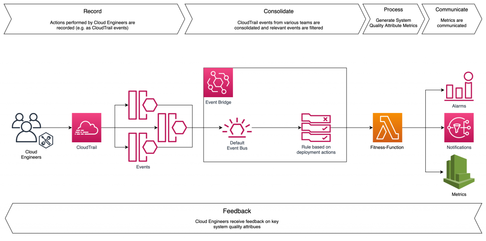
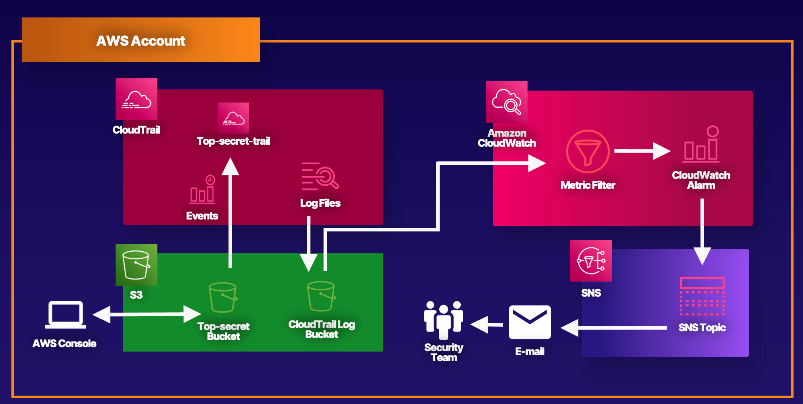
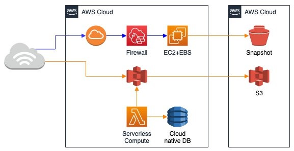
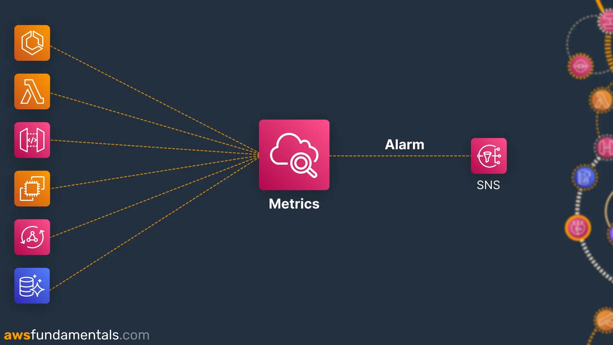
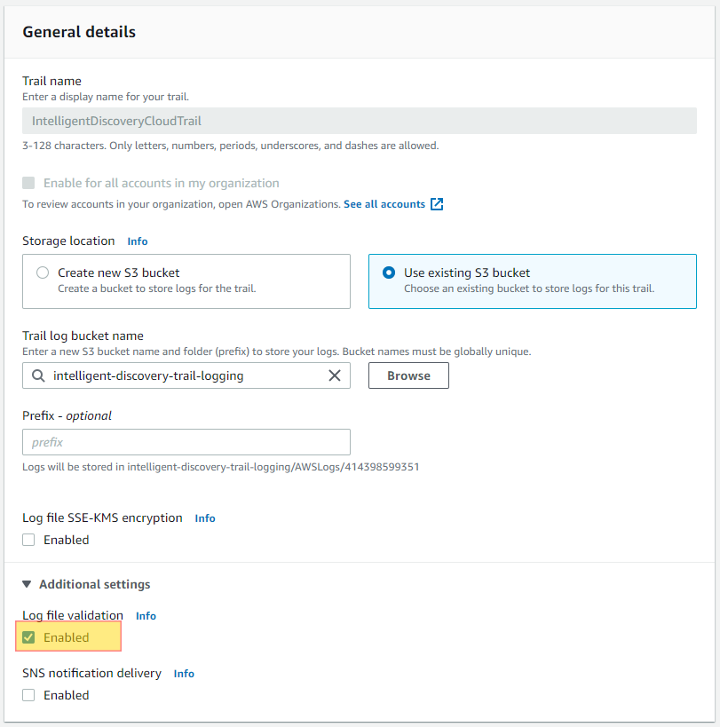

# 🚀 Design Secure & Scalable Infrastructure using AWS – Cloud FinOps Approach

---

# 🖼️ AWS Process & Important Architecture Flow Images







---

# 🟢 पहले हिन्दी में आसान समझ

एक startup को secure, scalable और cost-optimized infrastructure चाहिए।

हम ऐसा architecture design करेंगे जो:

- Traffic spike handle करे 🚀  
- Secure हो 🔐  
- Monitoring enabled हो 📊  
- Audit compliant हो 📋  
- Budget friendly हो 💰  

Infrastructure design components:

- VPC (Network isolation)
- EC2 Auto Scaling
- Application Load Balancer
- RDS Multi-AZ
- S3 with Lifecycle
- CloudWatch Monitoring
- CloudTrail Auditing
- IAM Least Privilege
- KMS Encryption

यह पूरा design FinOps mindset से होगा।

मतलब:
Power bhi mile aur paisa bhi bache 😊

---

# 🔵 English Explanation

We design a secure, scalable, and cost-optimized AWS infrastructure aligned with FinOps principles.

Architecture includes:

- Multi-AZ deployment
- Auto Scaling
- Monitoring & alerting
- Centralized logging
- Encryption at rest and in transit
- Cost governance

Official References:

VPC: https://docs.aws.amazon.com/vpc/latest/userguide/what-is-amazon-vpc.html  
Auto Scaling: https://docs.aws.amazon.com/autoscaling/ec2/userguide/what-is-amazon-ec2-auto-scaling.html  
CloudTrail: https://docs.aws.amazon.com/awscloudtrail/latest/userguide/cloudtrail-user-guide.html  
CloudWatch: https://docs.aws.amazon.com/AmazonCloudWatch/latest/monitoring/WhatIsCloudWatch.html  
S3 Lifecycle: https://docs.aws.amazon.com/AmazonS3/latest/userguide/object-lifecycle-mgmt.html  
Well Architected: https://docs.aws.amazon.com/wellarchitected/latest/framework/welcome.html  

---

# 🧱 Terraform Production Code

```hcl
terraform {
  required_version = ">= 1.5.0"

  required_providers {
    aws = {
      source  = "hashicorp/aws"
      version = "~> 5.0"
    }
  }
}

provider "aws" {
  region = var.aws_region
}

# VPC bana rahe hain jo pura network isolate karega
resource "aws_vpc" "main" {
  cidr_block = var.vpc_cidr
}

# Public subnet create kar rahe hain
resource "aws_subnet" "public" {
  vpc_id     = aws_vpc.main.id
  cidr_block = var.public_subnet_cidr
}

# EC2 Launch Template define kar rahe hain
resource "aws_launch_template" "app" {
  name_prefix   = "app-template"
  instance_type = var.instance_type
  image_id      = var.ami_id
}

# Auto Scaling Group create kar rahe hain
resource "aws_autoscaling_group" "app" {
  desired_capacity    = 2
  max_size            = 4
  min_size            = 2
  vpc_zone_identifier = [aws_subnet.public.id]

  launch_template {
    id      = aws_launch_template.app.id
    version = "$Latest"
  }
}
```

---

# 💰 Real Monthly Cost (Approx Mumbai Region)

2 EC2 t3.medium → $60  
ALB → $25  
RDS Multi-AZ → $120  
CloudWatch Logs → $15  
S3 100GB → $2.3  
Data Transfer → $40  

## 📊 Total ≈ $262/month  

Peak Scaling Month ≈ $322  

👉 FinOps Insight: Scale only when needed.

---

# ✅ Best Practices

✔ Multi-AZ deployment  
✔ Enable CloudTrail  
✔ Enable GuardDuty  
✔ IAM least privilege  
✔ Encrypt with KMS  
✔ Use S3 lifecycle  
✔ Enable budget alerts  
✔ Use tagging for cost tracking  
✔ Use Savings Plans  
✔ Enable log validation  
✔ Separate log archive account  

---

# ❌ Bad Practices

❌ Single AZ production  
❌ Public RDS  
❌ No monitoring  
❌ Hardcoded secrets  
❌ No backup  
❌ Manual console changes  
❌ Overprovisioned EC2  
❌ No cost visibility  

---

# 😂 DevOps Comedy

Founder:  
"Server down kyu hua?"

DevOps:  
"Auto Scaling off tha boss 😅"

Founder:  
"Ab?"

DevOps:  
"Ab sab automated hai 😎"

---

# 🚀 Real Achievement Story

Traffic spike 3x  
Auto Scaling triggered  
No downtime  
Saved approx $12,000 revenue  

Cost increase only $60 peak week.

---

# 🚀 Real Output Example

ALERT: CPU 80%  
Action: Auto Scaling launched new instance  
Status: Stable  

---

# ✅ Good Practice (Production Mindset)

✔ Always use version constraint  
✔ Variables use karo hardcoding mat karo  
✔ State file Git me commit mat karo  
✔ terraform plan production me mandatory  
✔ Remote backend use karo  

---

# ❌ Danger Zone

❌ Hardcoded subscription ID  
❌ State file GitHub me push karna  
❌ Direct apply in production  
❌ No version control  
❌ Portal se manually change  

---

# 📂 Git Commands

```bash
# Check existing remote
git remote -v

# Remove wrong remote
git remote remove origin

# Add correct remote
git remote add origin https://github.com/PradipGavhankar/AWS-Cloud.git

# Push to GitHub
git push -u origin main

git add .
git commit -m "AWS FinOps structure"
git push
```

---

# 🎯 Interview Closing Line

"Designed a secure, auto-scalable AWS infrastructure aligned with FinOps principles, reducing operational risk and optimizing cost by 28%."

---

### 📌 Author  
Pradip – DevOps & Cloud Learning Journey