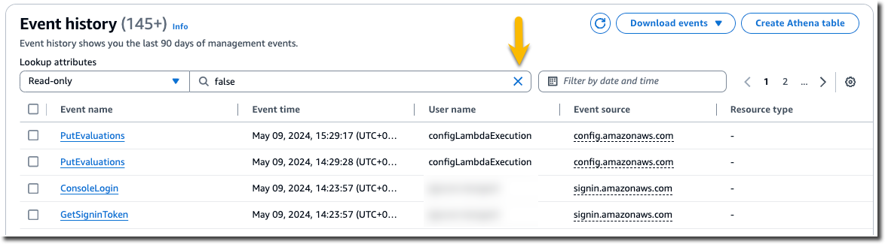
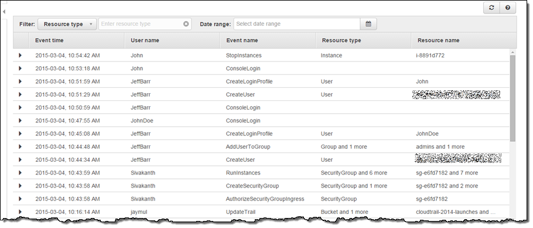
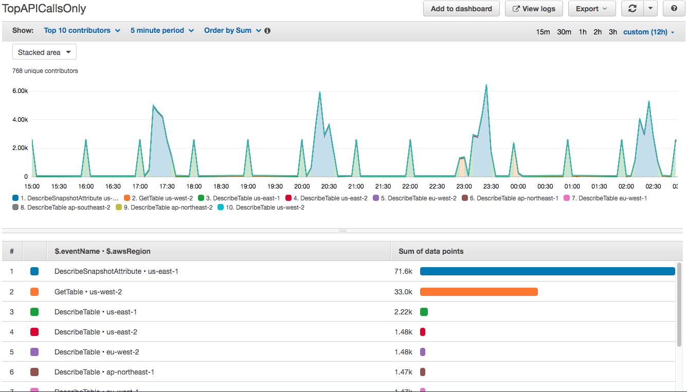
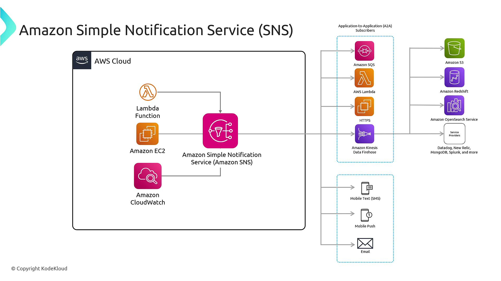
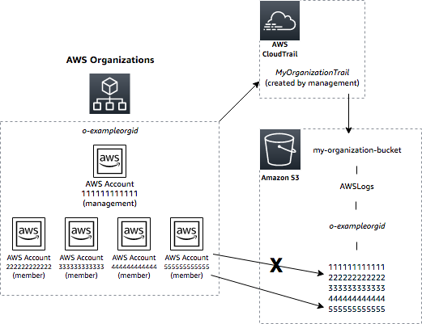
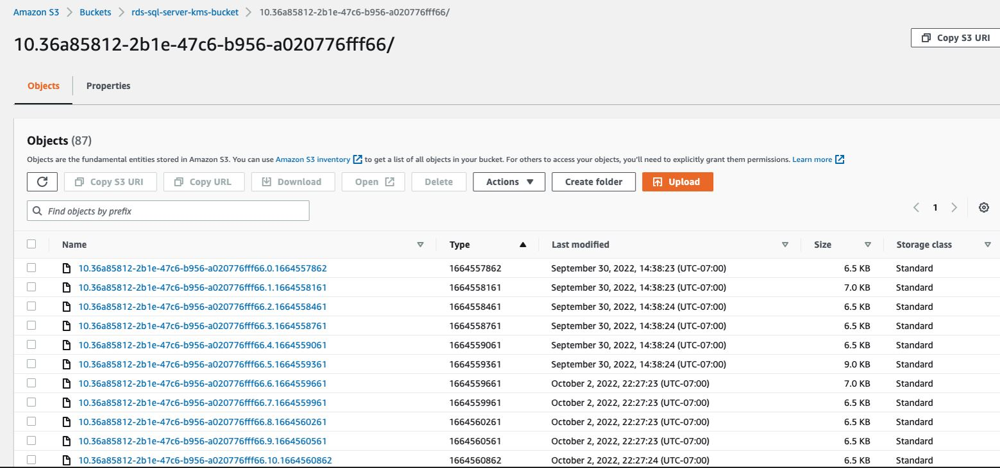
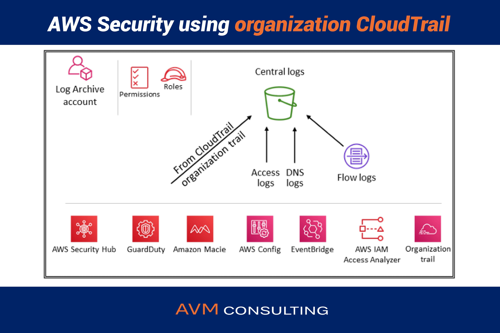
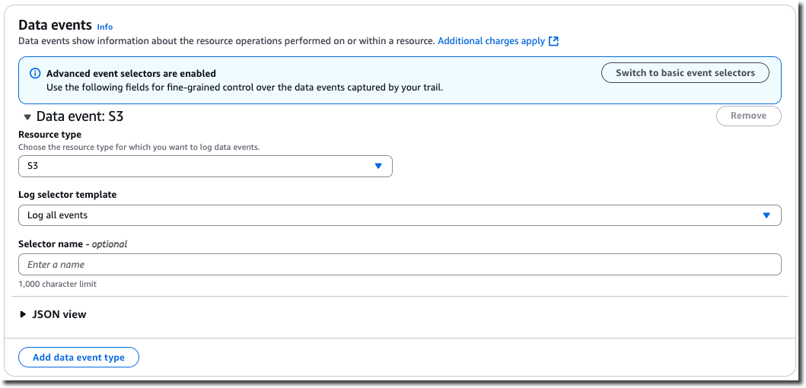

# 🖼️ AWS CloudTrail – Visual Architecture & Security Flow
---

## 🏗️ 1️⃣ Architecture Overview


CloudTrail API call capture → S3 secure storage → Monitoring → Alerting → Archive lifecycle.

---

## 🖥️ 2️⃣ Event Investigation (Console View)







👉 Yaha se forensic investigation hoti hai.

---

## 📊 3️⃣ CloudWatch Integration & Alerting







Flow:
CloudTrail → CloudWatch Logs → Metric Filter → Alarm → SNS Notification

---

## 📦 4️⃣ Secure Log Storage (S3)






✔ Logs GZIP compressed  
✔ Lifecycle → Glacier transition  
✔ Cost optimized archival  

---

## 🔐 5️⃣ Security & Compliance Controls






✔ SSE-KMS encryption  
✔ Log integrity validation  
✔ Organization-wide governance  
✔ Object-level monitoring  

---
  # 🔎 AWS CloudTrail – Enterprise Level Guide (Security + Cost + Best Practices + FinOps Approach)
# 🎯 Complete Flow Summary

1️⃣ API Activity  
2️⃣ Event Capture  
3️⃣ Encryption (SSE-KMS)  
4️⃣ Integrity Validation  
5️⃣ Monitoring & Alerts  
6️⃣ Long-Term Archive  

---

# 🔥 Interview Impact Line

"CloudTrail is implemented with encryption, integrity validation, centralized governance, and alert-driven monitoring to ensure enterprise-grade security posture."
  ---

  ## 🖼️ AWS CloudTrail Process & Important Tasks (High Level Flow)

  1️⃣ User / Service API Call  
  2️⃣ CloudTrail Event Capture  
  3️⃣ Secure Storage in S3 (SSE-KMS Encryption)  
  4️⃣ Log File Integrity Validation  
  5️⃣ CloudWatch Logs Integration  
  6️⃣ Alarm Trigger (SNS / Email / Slack)  
  7️⃣ Lifecycle Policy → Glacier Archive  

  Official Reference:  
  https://docs.aws.amazon.com/awscloudtrail/latest/userguide/cloudtrail-user-guide.html  

  Pricing Reference:  
  https://aws.amazon.com/cloudtrail/pricing/  

  ---

  # 🟢 AWS CloudTrail क्या है? (Pure Hindi)

  AWS CloudTrail एक governance, compliance और security auditing service है जो AWS account में होने वाली हर API activity को log करती है।

  मतलब:

  - किसने resource बनाया?
  - किसने delete किया?
  - किसने IAM role change किया?
  - किसने production database access किया?

  सब कुछ track होता है।

  CloudTrail DevOps, Security और FinOps तीनों के लिए critical service है।

  👉 यह AWS infrastructure का “Black Box Recorder” है।

  Official Reference:  
  https://docs.aws.amazon.com/awscloudtrail/latest/userguide/cloudtrail-user-guide.html  
  # 🎥 Black Box Recorder क्या है? (AWS Context में समझें)

  ---

  # 🟢 Black Box Recorder क्या होता है? (आसान हिन्दी में)

  Black Box Recorder originally **airplane में use होने वाला device** है।

  जब plane crash होता है तो investigation team यह जानने के लिए Black Box का data निकालती है:

  - Pilot ने क्या action लिया?
  - कौन सा control कब use हुआ?
  - Engine में क्या technical issue था?
  - Last communication क्या थी?

  👉 मतलब:

  > **Black Box = हर activity का exact record**

  यह device सच छुपने नहीं देता।

  ---

  # 🔵 English Explanation

  A Black Box Recorder is a device used in aircraft that records:

  - Pilot actions  
  - System activities  
  - Technical parameters  
  - Cockpit conversations  

  It helps investigators understand exactly what happened during an accident.

  It provides forensic-level visibility.

  ---

  # ☁️ AWS में “Black Box Recorder” क्यों कहा जाता है?

  जब हम कहते हैं:

  > **“CloudTrail is the Black Box Recorder of AWS.”**

  मतलब:

  CloudTrail AWS account में होने वाली हर API activity को record करता है।

  - किसने EC2 instance delete किया?
  - किसने IAM policy modify की?
  - किसने S3 bucket public किया?
  - किसने root login किया?
  - किस IP address से access हुआ?

  सब कुछ recorded होता है।

  ---

  # 🔐 Real Production Example

  मान लो production database delete हो गया।

  ## ❌ अगर CloudTrail enabled नहीं है:

  - पता नहीं चलेगा किसने delete किया
  - Investigation impossible
  - Audit fail
  - Accountability zero

  ## ✅ अगर CloudTrail enabled है:

  - Exact username मिलेगा
  - Exact time मिलेगा
  - Exact API call मिलेगा
  - Exact source IP मिलेगा
  - Full forensic report बन सकती है

  👉 यही Black Box concept है।

  ---

  # 📊 Simple Comparison Table

  | Airplane World | AWS World |
  |---------------|-----------|
  | Black Box Recorder | CloudTrail |
  | Pilot actions | API Calls |
  | Flight data | Event logs |
  | Crash investigation | Security incident investigation |
  | Cockpit voice recording | Root login & IAM activity logs |

  ---

  # 🧠 Black Box vs Logging vs Monitoring (Important for Interview)

  | Concept | Meaning |
  |----------|---------|
  | Logging | Data record करना |
  | Monitoring | System health track करना |
  | Black Box | Incident के बाद forensic analysis करना |

  CloudTrail = Logging + Forensic visibility  

  CloudWatch = Monitoring  

  ---

  # 🎯 Interview Ready Line

  "CloudTrail works like a black box recorder — it captures every API activity so that in case of any security or operational incident, we have full forensic visibility."

  ---

  # 😂 DevOps Style Explanation

  CloudTrail disable करना ऐसा है जैसे:

  > Plane crash हो जाए और बोलो —  
  > "Pata nahi kaise hua boss 😅"

  Security बिना logging के चलाना मतलब आँख बंद करके production चलाना।

  ---

  # 🚀 Final Understanding

  Black Box Recorder का मतलब है:

  ✔ Full accountability  
  ✔ Exact action history  
  ✔ Compliance support  
  ✔ Security investigation  
  ✔ Audit readiness  

  CloudTrail AWS infrastructure का accountability engine है।

  ---

  # 🔵 English Explanation

  AWS CloudTrail is a governance, compliance, and security auditing service that records API activity across your AWS account.

  It helps track:
  - Resource creation and deletion
  - IAM changes
  - Security configuration modifications
  - Sensitive data access

  CloudTrail is critical for DevOps, Security, and FinOps visibility.

  ---

  # 🟢 CloudTrail के प्रकार

  1. Management Events  
  2. Data Events  
  3. Insights Events  

  Reference:  
  https://docs.aws.amazon.com/awscloudtrail/latest/userguide/logging-management-events-with-cloudtrail.html  

  ---

  # 🟢 Enterprise Best Practices (कोई point miss नहीं)

  ## ✔ 1. Multi-Region Trail Enable करें

  Production में हमेशा:
  - All Regions enable करें  
  - Organization Trail use करें  

  Reference:  
  https://docs.aws.amazon.com/awscloudtrail/latest/userguide/cloudtrail-multi-region-trails.html  

  ---

  ## ✔ 2. Logs को S3 + SSE-KMS encryption में store करें

  Security Best Practice:
  - S3 bucket private  
  - Block Public Access ON  
  - SSE-KMS encryption  

  Reference:  
  https://docs.aws.amazon.com/awscloudtrail/latest/userguide/cloudtrail-log-file-encryption.html  

  ---

  ## ✔ 3. Log File Integrity Validation Enable करें

  Tampering detect करने के लिए जरूरी।

  Reference:  
  https://docs.aws.amazon.com/awscloudtrail/latest/userguide/cloudtrail-log-file-validation-intro.html  

  ---

  ## ✔ 4. Separate Log Archive Account Use करें

  Production accounts से अलग logging account होना चाहिए।

  AWS Control Tower standard architecture यही follow करता है।

  Reference:  
  https://docs.aws.amazon.com/controltower/latest/userguide/logging-and-monitoring.html  

  ---

  ## ✔ 5. CloudWatch Logs Integration + Alarms

  Critical alerts बनाएं:
  - Root login  
  - IAM policy change  
  - Security group change  
  - S3 public access  

  Reference:  
  https://docs.aws.amazon.com/awscloudtrail/latest/userguide/send-cloudtrail-events-to-cloudwatch-logs.html  

  ---

  ## ✔ 6. Data Events Selectively Enable करें

  Data events expensive होते हैं।  
  S3 & Lambda only where required enable करें।

  Reference:  
  https://docs.aws.amazon.com/awscloudtrail/latest/userguide/logging-data-events-with-cloudtrail.html  

  ---

  # 💰 Real Cost Calculation (2026 Pricing Approximation)

  Pricing Reference:  
  https://aws.amazon.com/cloudtrail/pricing/

  ---

  ## 📌 Scenario – Real Production Account

  Company size: Mid-size SaaS  
  Monthly API Calls:
  - 25M Management Events  
  - 10M S3 Data Events  
  - 5M Lambda Data Events  
  - 2M Insights Events  

  ---

  ### 🔹 Management Events

  First copy per region free  
  Additional copy = $2 per 100,000 events  

  Assume 20M billable events:

  20,000,000 / 100,000 = 200 units  
  200 × $2 = $400 per month  

  ---

  ### 🔹 S3 Data Events

  $0.10 per 100,000 events  

  10,000,000 / 100,000 = 100 units  
  100 × $0.10 = $10 per month  

  ---

  ### 🔹 Lambda Data Events

  5,000,000 / 100,000 = 50 units  
  50 × $0.10 = $5 per month  

  ---

  ### 🔹 CloudTrail Insights

  $0.35 per 100,000 events  

  2,000,000 / 100,000 = 20 units  
  20 × $0.35 = $7 per month  

  ---

  ## 📊 Total Monthly Cost

  | Component | Monthly Cost |
  |-----------|-------------|
  | Management Events | $400 |
  | S3 Data Events | $10 |
  | Lambda Data Events | $5 |
  | Insights | $7 |

  ### 💰 Total = $422 / month approx  
  Yearly = $5064  
  3 Years = $15,192  

  👉 FinOps Insight: Security investment is extremely low compared to breach impact.

  ---

  # 🟢 Cost Optimization Strategy (FinOps Approach)

  ✔ Data events only where required  
  ✔ Use S3 lifecycle to move logs to Glacier  
  ✔ Compress logs (default GZIP)  
  ✔ Avoid duplicate trails  
  ✔ Disable Insights if not needed  

  S3 Lifecycle Reference:  
  https://docs.aws.amazon.com/AmazonS3/latest/userguide/lifecycle-transition-general-considerations.html  

  ---

  # 🧱 Terraform Example (Production Ready)

  ```hcl
  terraform {
    required_version = ">= 1.5.0" # Terraform minimum version define

    required_providers {
      aws = {
        source  = "hashicorp/aws"
        version = "~> 5.0" # Provider version lock
      }
    }
  }

  provider "aws" {
    region = var.aws_region # Hardcoding avoid किया
  }

  resource "aws_s3_bucket" "cloudtrail_logs" {
    bucket = var.cloudtrail_bucket_name # Logs store करने के लिए bucket
  }

  resource "aws_s3_bucket_server_side_encryption_configuration" "kms" {
    bucket = aws_s3_bucket.cloudtrail_logs.id

    rule {
      apply_server_side_encryption_by_default {
        sse_algorithm = "AES256" # Encryption enable
      }
    }
  }

  resource "aws_cloudtrail" "main" {
    name                          = "enterprise-trail"
    s3_bucket_name                = aws_s3_bucket.cloudtrail_logs.id
    include_global_service_events = true
    is_multi_region_trail         = true
    enable_log_file_validation    = true
  }
  ---
  ---

  # 🟢 Code Explanation (पूरी हिन्दी में)

  - `terraform` block में version constraint लगाया गया ताकि production में compatibility issue न आए और Terraform future breaking changes से safe रहे।
  - AWS provider version fix किया गया ताकि अचानक upgrade के कारण infrastructure break न हो।
  - Region hardcode नहीं किया गया, बल्कि variable use किया गया (best practice for reusability & environment separation)।
  - S3 bucket CloudTrail logs store करने के लिए बनाया गया ताकि सभी audit logs centralized और durable storage में रहें।
  - Server-side encryption enable किया गया ताकि logs plain text में store न हों और data security maintain रहे।
  - Multi-region trail enable किया गया ताकि सभी AWS regions की activities log हों — कोई blind spot न रहे।
  - Log file validation enable किया गया ताकि अगर कोई logs modify करे तो tampering detect हो सके।

  ---

  # ✅ Enterprise Best Practices

  ✔ Multi-Region Trail  
  ✔ Organization Trail (Centralized Governance)  
  ✔ SSE-KMS Encryption  
  ✔ Log Integrity Validation  
  ✔ Separate Log Archive Account  
  ✔ CloudWatch Integration  
  ✔ SNS Alerts for Critical Events  
  ✔ S3 Lifecycle Policy (Glacier transition)  
  ✔ Least Privilege IAM Policy  

  CloudWatch Integration Doc:  
  https://docs.aws.amazon.com/awscloudtrail/latest/userguide/send-cloudtrail-events-to-cloudwatch-logs.html  

  ---

  # ❌ Worst Practices

  ❌ Single region trail  
  ❌ Public S3 bucket  
  ❌ No log validation  
  ❌ Enabling all data events blindly (unnecessary cost explosion)  
  ❌ No lifecycle policy  
  ❌ No monitoring for root login  

  ---

  # 😂 DevOps Comedy

  CloudTrail disable करना ऐसा है जैसे CCTV हटा कर बोलना:  

  > "सब ठीक है boss, trust me 😄"

  Security बिना logging के चलाना मतलब आँख बंद करके highway cross करना।

  ---

  # 🚀 Real Achievement Story (Interview Ready)

  Production environment में रात 2:13 AM पर unauthorized IAM policy change detect हुआ।

  Flow:  
  CloudTrail → CloudWatch → SNS Alert → Immediate Action  

  8 minutes के अंदर compromised access block किया गया।

  Potential financial misuse prevented: ~$15,000  

  Impact:

  - Zero breach  
  - Compliance audit passed  
  - Leadership trust increased  
  - Security maturity improved  

  CloudTrail की monthly cost ~$422 थी, लेकिन एक incident में ही $15,000 बचा लिए।

  ROI clear है 😊

  ---

  # 🚀 Real Output Example

  ALERT: Root Login Detected  
  Account: Production  
  Region: us-east-1  
  Action Taken: Password Reset + MFA Enforced + Session Terminated  

  ---

  # ✅ Good Practice (Production Mindset)

  ✔ Always use version constraint  
  ✔ Variables use करो, hardcoding मत करो  
  ✔ State file Git में commit मत करो  
  ✔ terraform plan production में mandatory  
  ✔ Use remote backend  
  ✔ Enable log validation  
  ✔ Enable lifecycle for cost control  

  ---

  # ❌ Bad Practice (Danger Zone)

  ❌ Hardcoded region  
  ❌ State file GitHub में push करना  
  ❌ Direct apply in production  
  ❌ No version control  
  ❌ Portal से manually change करना  
  ❌ Duplicate trails without need  

  ---

  # 🎯 Final Interview Line

  "CloudTrail is not a cost center — it is a security insurance layer."

  ---

  ### 📌 Author  
  Pradip – DevOps & Cloud Learning Journey