# 📊 Complete FinOps Dashboard Guide

---

# 🟢 AWS Cost Explorer

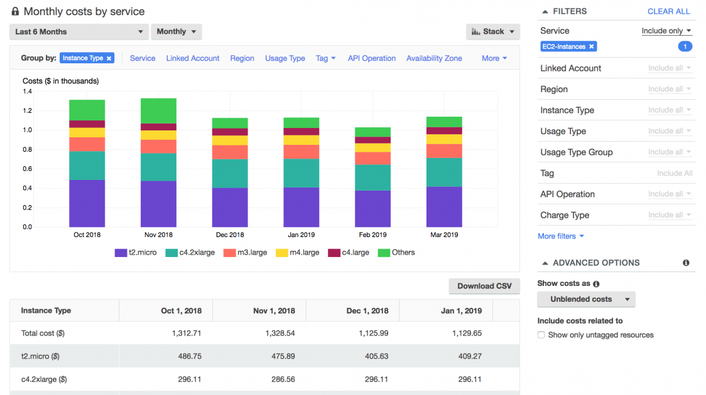

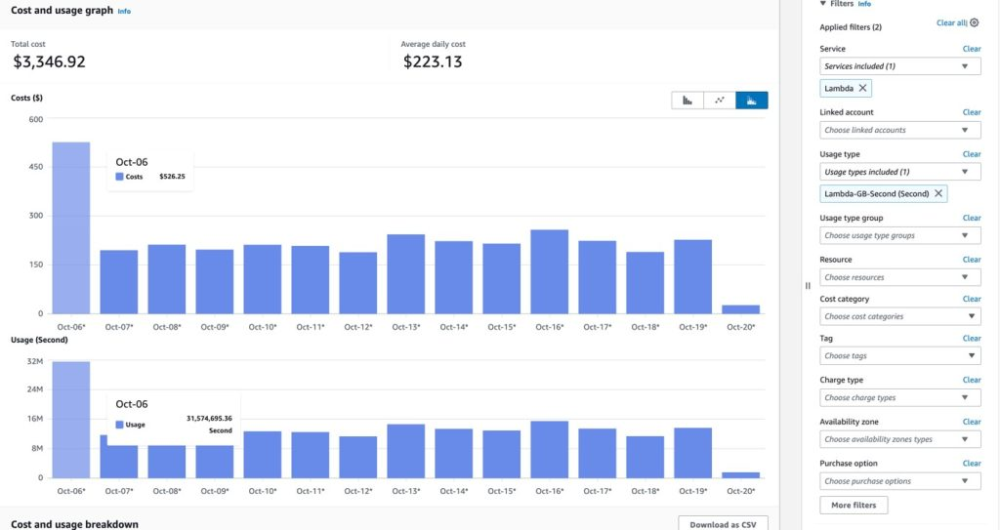

---

# 🟢 AWS Budgets

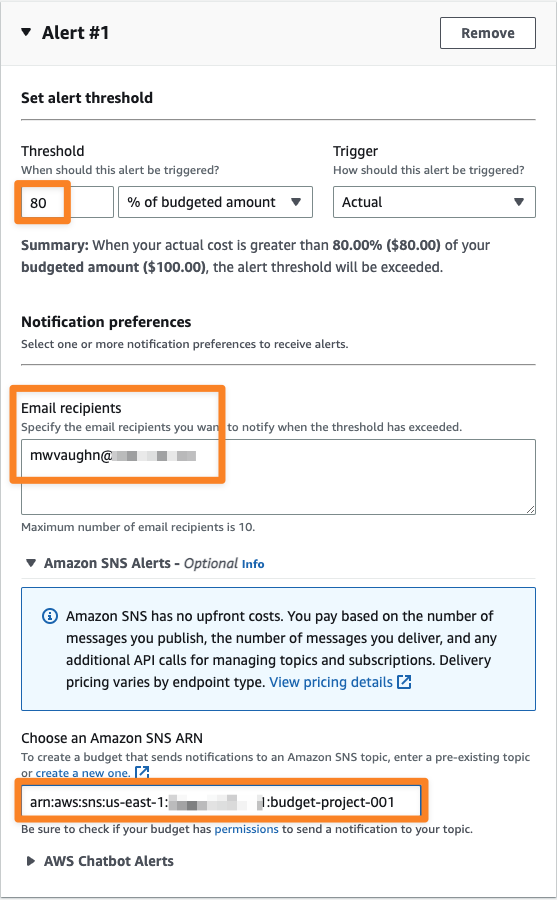

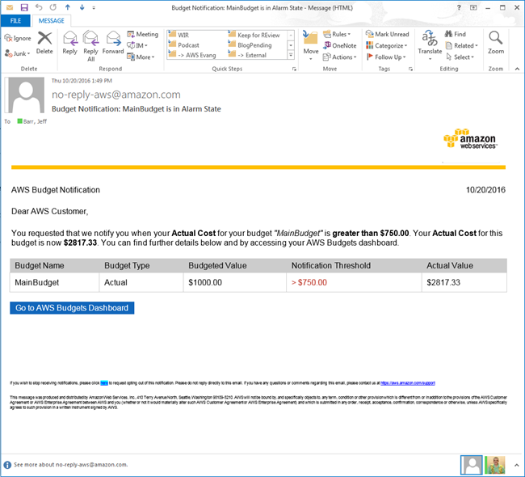

---

# 🟢 AWS Cost Anomaly Detection

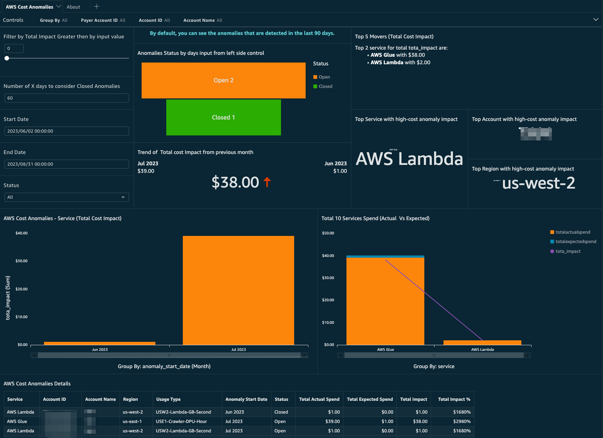
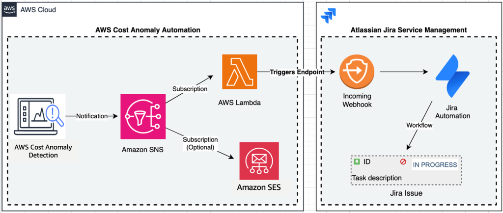
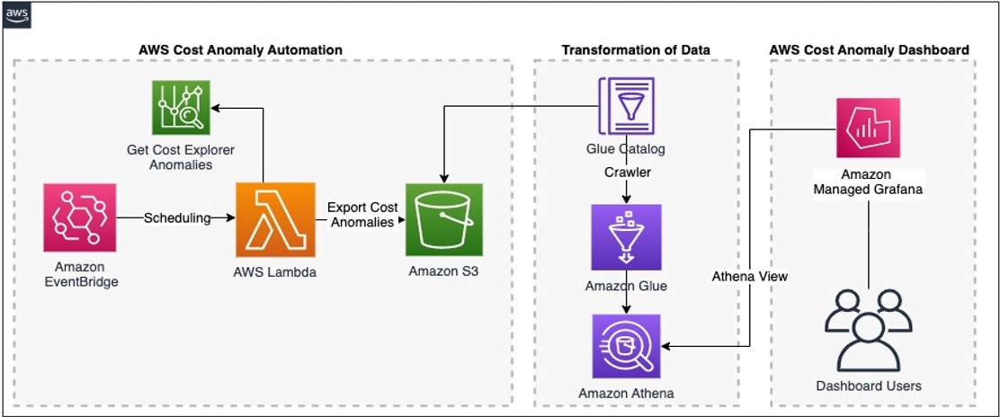
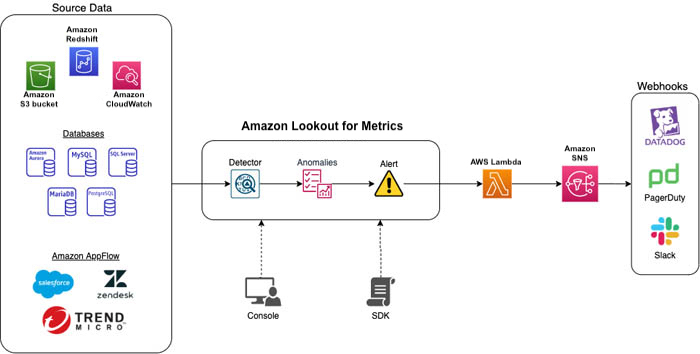

---

# 🟢 AWS CloudWatch Monitoring

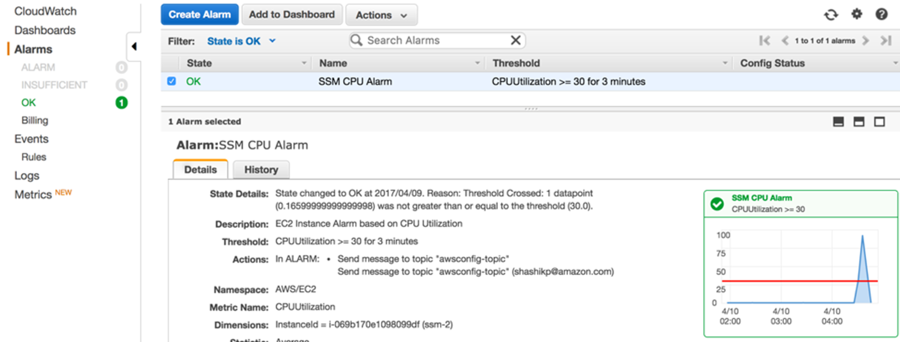
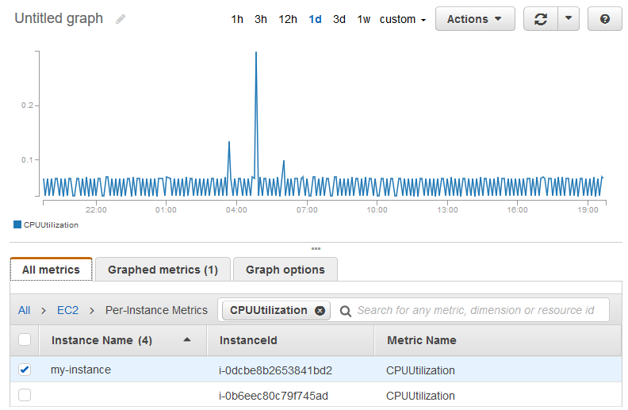
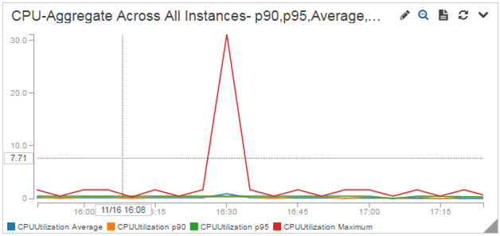

---

# 🏢 CloudHealth Enterprise Dashboard

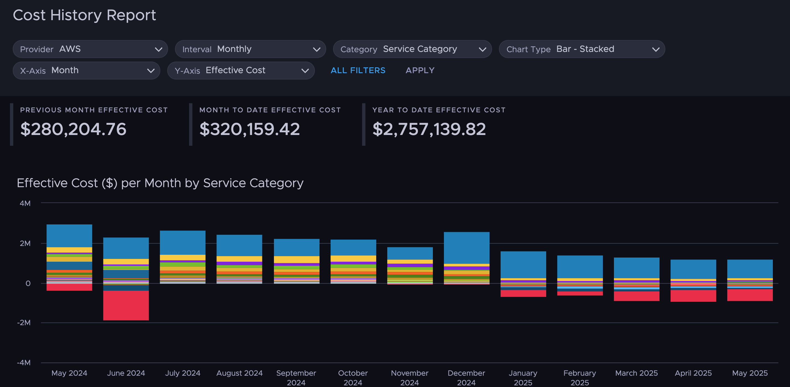
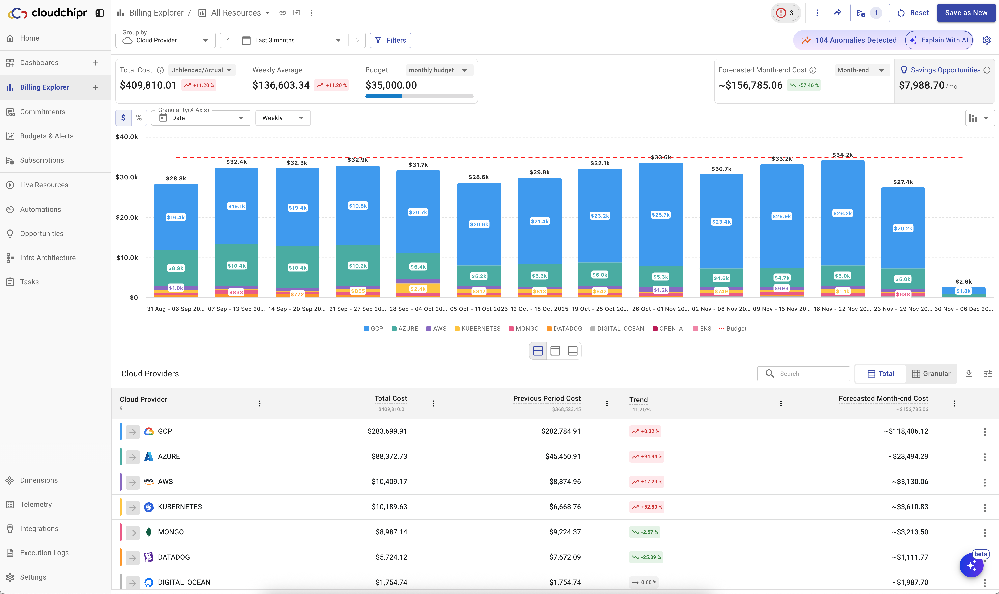
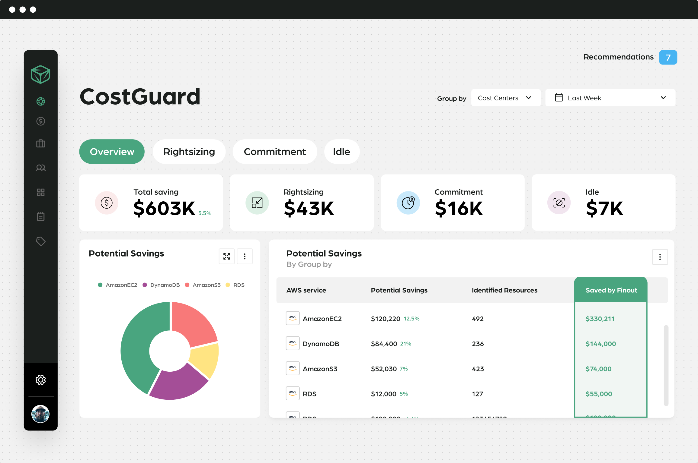
