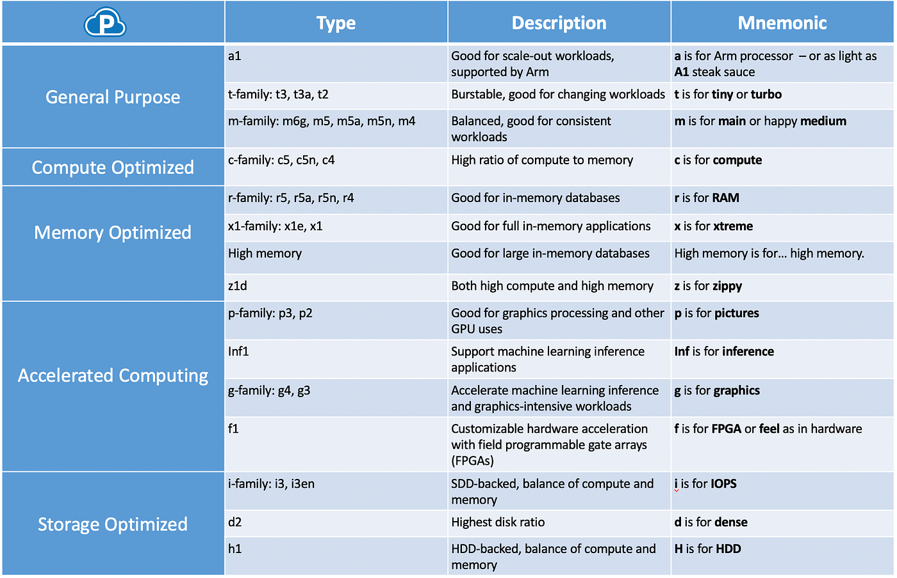

# 🚀 Day 1 – AWS EC2 Introduction

---

## 1️⃣ AWS Console Overview

Screenshot:

---

## 2️⃣ EC2 Instance List

Screenshot:

### Key Observations:

- Instance ID
- Instance Type (t2.micro)
- Availability Zone
- Instance State
- Status Checks
- Public DNS

---

## 3️⃣ Instance Running

---

## 4️⃣ Instance Details

